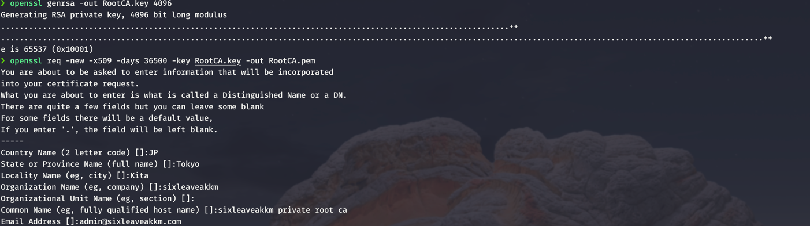

# TLS

## Create Certificate Authority (CA)
```shell
openssl genrsa -out RootCA.key 4096
openssl req -new -x509 -days 36500 -key RootCA.key -out RootCA.pem
```


**Mac could create ca through keychain.app**, but found it hard to use...
